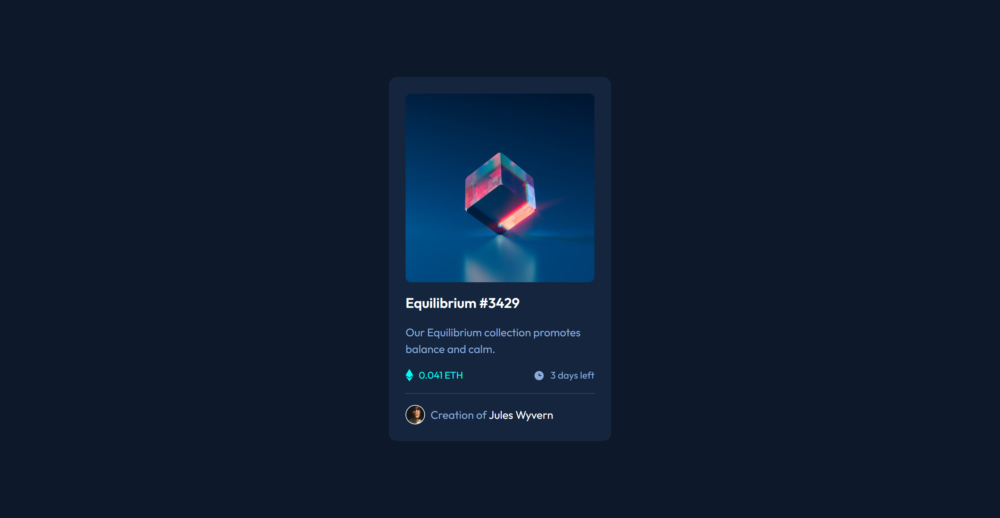

# Frontend Mentor - NFT preview card component solution

This is a solution to the [NFT preview card component challenge on Frontend Mentor](https://www.frontendmentor.io/challenges/nft-preview-card-component-SbdUL_w0U). Frontend Mentor challenges help you improve your coding skills by building realistic projects. 

## Table of contents

- [Overview](#overview)
  - [The challenge](#the-challenge)
  - [Screenshot](#screenshot)
  - [Links](#links)
- [My process](#my-process)
  - [Built with](#built-with)
  - [What I learned](#what-i-learned)
  - [Continued development](#continued-development)
  - [Useful resources](#useful-resources)
- [Author](#author)
- [Acknowledgments](#acknowledgments)


## Overview

### The challenge

Users should be able to:

- View the optimal layout depending on their device's screen size
- See hover states for interactive elements

### Screenshot




### Links

- Solution URL: [https://www.frontendmentor.io/solutions/nft-preview-card-component-j6scdTHk7b](https://www.frontendmentor.io/solutions/nft-preview-card-component-j6scdTHk7b)
- Live Site URL: [https://lloydb95.github.io/NFT-Preview-Card/](https://lloydb95.github.io/NFT-Preview-Card/)

## My process

### Built with

- Semantic HTML5 markup
- Tailwind CSS
- Flexbox
- CSS Grid
- Mobile-first workflow

### What I learned

For this challenge, I had learnt how to make a component using a single column. One of the main things I had learnt was how to hide an image and allow it to transtition into another for a much more design oriented look. It allows for the site/element to have an interactive feel and less static. 

This code snippet below shows how I made the image transition, you can even use different transition durations to give it a quick or slower transition.

```html
    <div class="relative rounded-lg overflow-hidden group cursor-pointer">
      <div class="bg-cyan/50 inset-0 absolute group-hover:opacity-100 opacity-0 duration-300 transition"></div>
      
      
    </div>
```

### Continued development

I will continue to use the transition feature to either hide certain elements of a site unless hovered over or to bring more life into a component. It can be used for buttons used as links too so it's versatility will be greatly appreciated in the projects to come.

### Useful resources

- [Tailwind CSS - Transition Duration](https://tailwindcss.com/docs/transition-duration) - This was crucial for the development of this component as it allowed me to add the interactive element on the image and the "links".
- [Tailwind CSS - Opacity](https://tailwindcss.com/docs/opacity) - This class has helped me to understand different opacity levels both in normal viewing and with the hover capability within Tailwind.

## Author

- Frontend Mentor - [@LloydB95](https://www.frontendmentor.io/profile/LloydB95)

## Acknowledgments

I have had extensive help from a colleague with vast knowledge on the subject.
